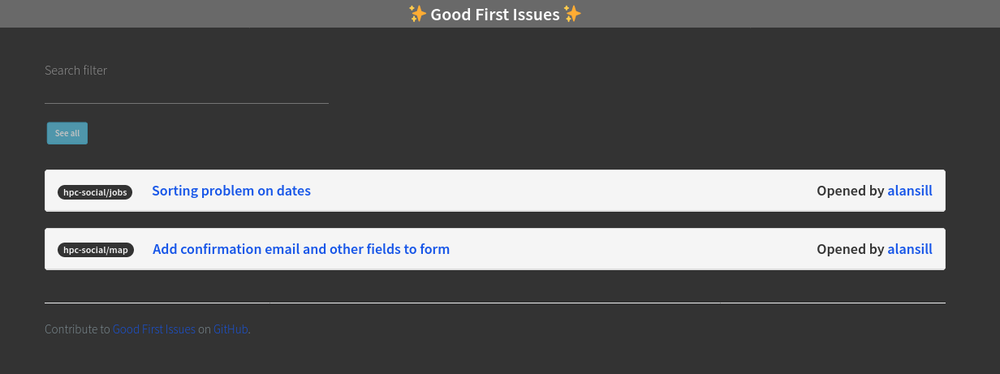

# Good First Issues!

Do you have a project or community that might offer some "Good First Issues"
for the hpc.social community? Add your full repository name to [.github/repos.txt](.github/repos.txt)
and any issue labeled with "Good First Issue" will show up automatically in the list.
That's it!



This respository is based on the the [rseng/good-first-issues](https://github.com/rseng/good-first-issues)
action to generate and update issues. We have automation in [.github/workflows/main.yaml](.github/workflows/main.yaml)
to automate adding repos with good first issues:

```bash
$ python .github/scripts/add-repos.py
$ python .github/scripts/generate-first-issues.py
```

Note that we have customized that main script for this repository, namely we do
not generate a body for the issue (as we do not use it, and with a large number
it can generate more bugs than it is worth!)

Thanks for stopping by!
